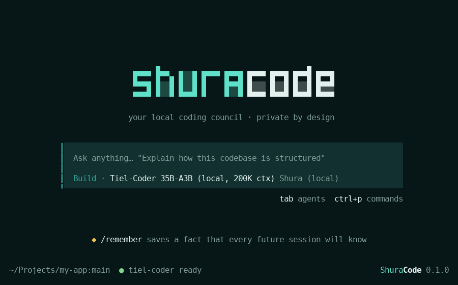
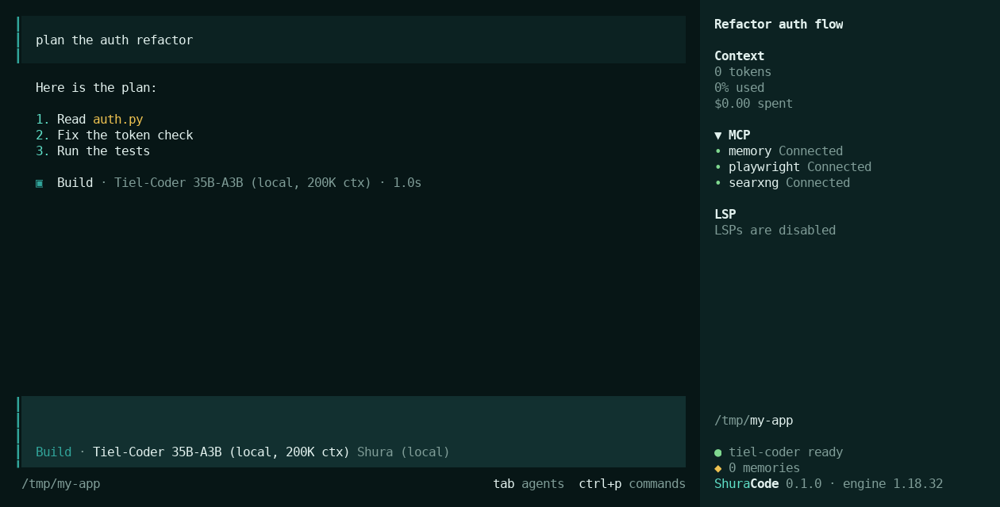

<div align="center">


# ShuraCode

**A private, local AI coding agent for the terminal, with a memory that lasts across sessions.**

English · [Русский](README.ru.md)

</div>



> [!NOTE]
> **Thank you.** ShuraCode is built on other people's work:
> [**OpenCode**](https://github.com/anomalyco/opencode) is its engine, and everything here is a layer
> on top of it. [**thecodacus**](https://github.com/thecodacus) wrote the llama.cpp `perf` fork that runs
> the model fast on a single GPU, and his [understory](https://github.com/thecodacus/understory) inspired
> the permanent memory. **peculiar-ragdoll** made Tiel-Coder. The browser and web search tools come from
> [Playwright MCP](https://github.com/microsoft/playwright-mcp), [SearXNG](https://github.com/searxng/searxng)
> and [mcp-searxng](https://github.com/ihor-sokoliuk/mcp-searxng).

ShuraCode is the coding agent of [Shura](https://github.com/hikkian/shura), which runs Tiel-Coder 35B on
your own GPU. Everything runs on your machine: the model, the agent, and its memory.

- **Permanent memory.** Say "remember that I prefer pytest", and every future session knows it. Memories
  are plain markdown files you can read, edit and delete.
- **Two modes.** **Build** makes changes. **Plan** only reads and proposes, and a shell redirect cannot
  slip a write past it. Press Tab to switch.
- **Commands.** `/remember`, `/forget`, `/memory`, `/test`, `/commit`, `/review`, and `/guide`: the full list of commands and keys, in English or Russian (also in [docs/COMMANDS.md](docs/COMMANDS.md)).
- **Live model status.** The footer shows whether the local model is loaded, loading or asleep.
- **Offline by default.** No update checks, no sharing, no model catalogue downloads, no telemetry.



## Built on OpenCode

ShuraCode is built on [OpenCode](https://github.com/anomalyco/opencode) (MIT), used as its engine. It
does not fork OpenCode. It adds its own layer through OpenCode's public extension points:

| Layer | What it adds |
|---|---|
| `bin/shuracode` | the command, its own config folder, offline settings, and the process name `shuracode` |
| `plugin/shuracode.tsx` | UI plugin: logo, footer, sidebar, tips, window title, model status |
| `plugin/server.ts` | server plugin: the agent introduces itself as ShuraCode |
| `mcp/memory.py` | the memory server (Python standard library only) |
| `config/`, `commands/`, `themes/` | model provider, permissions, rules, slash commands, theme |

Because nothing inside the engine is modified, engine updates keep ShuraCode's look, name and features.
`shuracode update` installs the new engine next to the current one and runs a self-test on it:

- the logo, footer and window title are drawn;
- the agent still introduces itself as ShuraCode and names the model it runs on.

It switches to the new engine only if every check passes. If a check fails, you stay on the current
version. `shuracode rollback` returns to the previous one.

## Install

With Shura, `setup.sh` installs ShuraCode for you. On its own:

```bash
git clone https://github.com/hikkian/shuracode.git && cd shuracode
./install.sh                      # engine, config, memory, the `shuracode` command
shuracode doctor                  # check everything
```

Requirements: Linux x86_64, Node.js 18+, Python 3.10+, and an OpenAI-compatible model endpoint. The
default endpoint is the Shura gateway at `http://127.0.0.1:8080/v1`. Point ShuraCode at another one with
`./install.sh --base-url URL --status-url ""`.

## Usage

```bash
cd your-project && shuracode      # open the TUI
shuracode run "explain src/app.py"   # one-shot
shuracode update | rollback | doctor | version | help
```

| Command | What it does |
|---|---|
| `/remember [fact]` | saves the fact; without an argument, saves the most useful thing learned in this session |
| `/forget <topic>` | finds the matching memory and deletes it; asks if several match |
| `/memory` | lists what is remembered and flags outdated or duplicate memories |
| `/test` | finds how this project runs its tests, runs them, fixes failures, and shows the real result |
| `/commit` | commits one logical change in the repository's style; never pushes, adds no attribution lines |
| `/review` | reviews uncommitted changes (or a commit, branch or PR) |

## Memory

Each memory is one markdown file in `~/.local/share/shuracode/memory/`, with a type:

- `user`: who you are and how you work;
- `feedback`: corrections and confirmed approaches;
- `project`: knowledge that is not in the code;
- `reference`: links.

The index, `MEMORY.md`, is loaded into every session, so the model knows what it remembers before its
first step. Short memories appear in the index in full.

The model writes memories through four tools (`memory_save`, `memory_read`, `memory_search`,
`memory_delete`). The memory server enforces the rules:

- one file per fact;
- saving under an existing name updates that memory;
- the index is rebuilt after every change;
- limits: 100 memories, 2000 characters each;
- anything that looks like a credential is refused.

When to remember is decided by the rules in [`config/AGENTS.md`](config/AGENTS.md). There is no second
"librarian" model, so memory costs no extra model calls. The disk is written only when a memory is saved
or deleted.

Measured with Tiel-Coder: a preference saved in one session was applied in three new sessions out of
three. A change of mind updated the existing memory instead of adding a duplicate. A GitHub token was
refused.

## Build and Plan

| Mode | Files | Shell |
|---|---|---|
| Build | edits allowed | tests, git (except push) and read-only tools run without asking; anything else asks first; `rm -rf`, `mkfs`, `reboot`, ... are denied |
| Plan | edits denied | only read-only commands run without asking (`git status/diff/log/show`, `ls`, `cat`, `grep`, `rg`, `find`, ...); anything with `>` or `tee` asks first; `find -delete` is denied |

Each rule was checked by having a scripted model request the tool call and seeing what actually happened.

## Where things live

| Path | What |
|---|---|
| `~/.config/shuracode/` | `shuracode.json`, `tui.json`, `AGENTS.md`, `commands/` |
| `~/.local/share/shuracode/engine/` | the current and the previous engine |
| `~/.local/share/shuracode/memory/` | memories (folder `0700`, files `0600`) |
| `~/.local/bin/shuracode` | the command |

The engine keeps its session history and caches in its standard folders (`~/.local/share/opencode`,
`~/.cache/opencode`), and a copy of the theme in `~/.config/opencode/themes`.

## Known limits

- The engine's own `--help` output for subcommands and a few rarely seen dialogs still show the engine's
  name. Changing those would require a fork.
- Tested on Fedora 44 with Ghostty and GNOME. Other Linux distributions and terminals should work but are
  untested.

## License

MIT, see [LICENSE](LICENSE). OpenCode is MIT-licensed by its authors. See [NOTICE](NOTICE).
